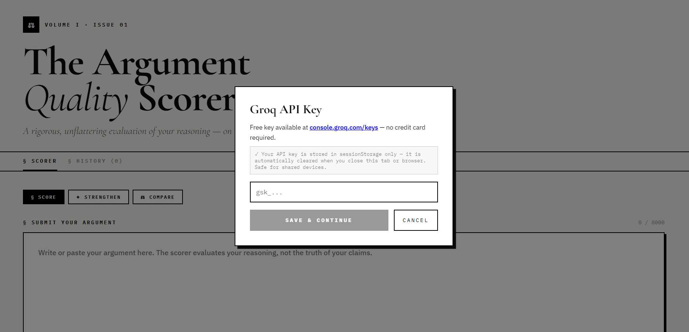
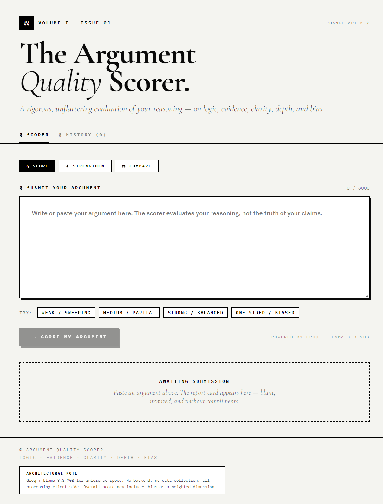
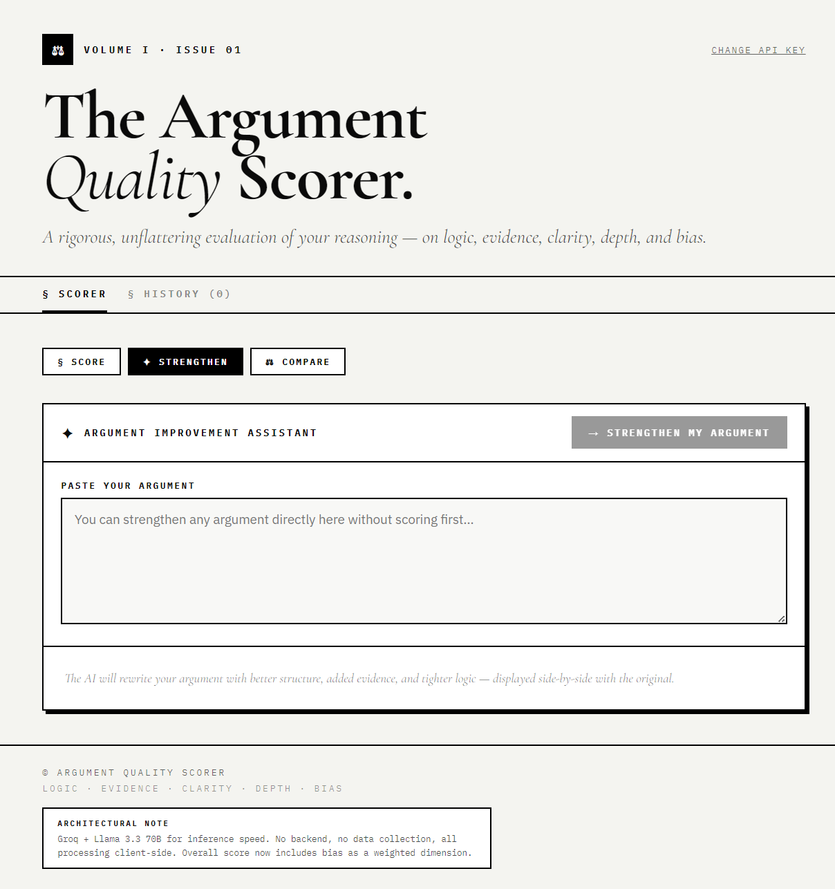
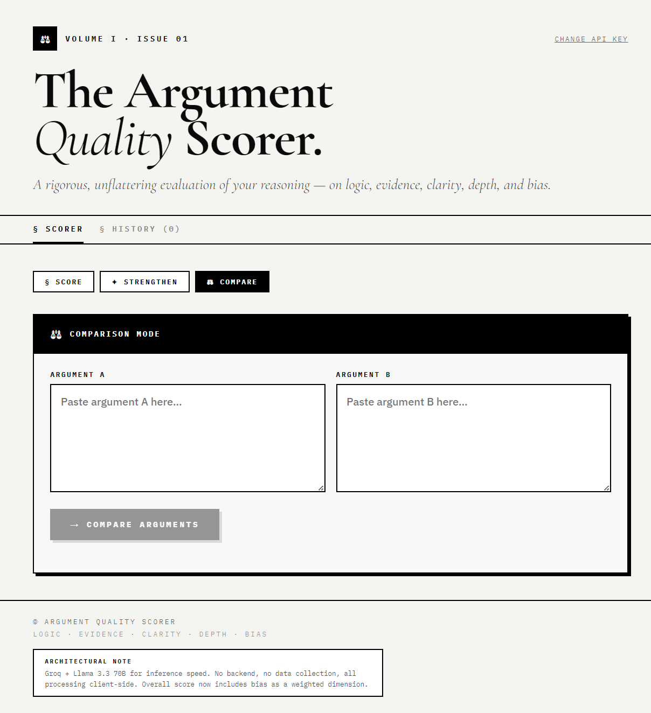
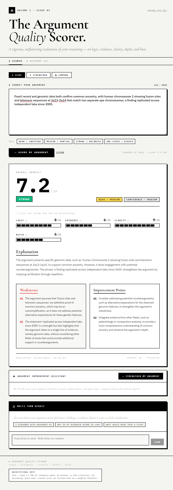
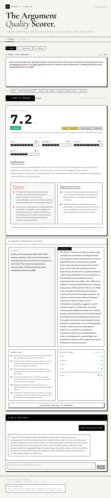
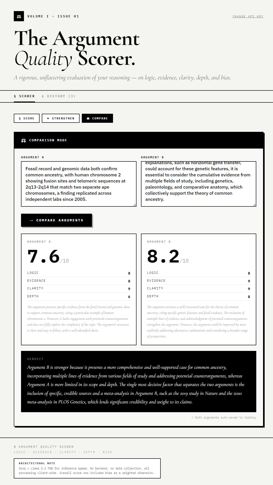

# ArgusScorer — Argument Quality Scorer

> *A rigorous, unflattering evaluation of your reasoning — on logic, evidence, clarity, depth, and bias.*

ArgusScorer is a client-side web application that uses AI to analyze and score written arguments across five critical dimensions. It helps students, debaters, researchers, and writers identify logical flaws, weak evidence, and bias in their reasoning — and then automatically rewrites their argument to a higher standard.

---

## 🖼️ Screenshots

### API Setup

*Add and save Groq API key*

### Argument Scorer Interface

*Complete interface overview*

### Strengthen Argument

*Visual workflow for strengthening arguments*

### Comparison Page

*Argument comparison visuals*

### Scoring Result

*Input argument and view generated score*

### Strengthen & Multi-Turn Debate

*AI rewrites weak argument, then improves 9/10 argument using multi-turn debate*

### Weak vs Strong Comparison

*Analysis showing strength difference between AI-generated arguments*

---

## 🔍 What is ArgusScorer?

Most writing tools tell you *how* to write better — fix your grammar, vary your sentence length, add transitions. ArgusScorer does something different: it tells you *why your reasoning is weak* and gives you a score breakdown with specific, quoted evidence from your own argument.

It is built around a simple idea: **a well-written argument is worthless if the logic is bad.** ArgusScorer forces you to confront that.

### Who is it for?

- **Students** submitting essays, debate prep, or critical thinking assignments
- **Researchers** stress-testing their claims before peer review
- **Debaters** identifying weaknesses an opponent would exploit
- **Anyone** who wants to think and write more rigorously

---

## ❓ Why This Project?

Most AI writing tools are designed to validate you. They suggest synonyms, improve flow, and make your writing sound more confident — regardless of whether your argument actually holds up.

ArgusScorer was built to do the opposite: to be the harshest, most honest reviewer you can have before a real audience sees your work. It evaluates **reasoning quality**, not surface-level writing quality.

The evaluation is also **transparent** — every weakness is quoted directly from your text, every score has a clickable explanation, and the "Strengthen" feature shows exactly what changed and why.

---

## ⚙️ How It Works

ArgusScorer is a **single HTML file** — no backend, no server, no database. Everything runs in your browser.

### Tech Stack

| Layer | Technology |
|---|---|
| Frontend | React 18 (UMD, no build step) |
| AI Inference | Groq API — `llama-3.3-70b-versatile` |
| Storage | `sessionStorage` (API key) · `localStorage` (history only) |
| Styling | Inline CSS + Google Fonts |
| Build | None — open the file directly |

### Why Groq?

Groq was chosen for two reasons:
1. **Speed** — approximately 10x faster than GPT-4 at inference
2. **Free tier** — no credit card required, generous rate limits for individual use

### Why a single HTML file?

- Zero setup for evaluators or users
- No build pipeline to debug
- No data leaves the user's machine except Groq API calls
- Easy to submit, share, and run anywhere

---

## 🔄 Workflow / Feature Walkthrough

### 1. Score Tab (`§ Score`)

**Input → Evaluate → Report**

1. Paste or type your argument (10 – 8,000 characters)
2. Click **→ Score my argument**
3. Receive a full report card:

| Dimension | What it measures |
|---|---|
| **Logic** | Are conclusions actually supported by the premises? |
| **Evidence** | Are there named studies, statistics, or concrete examples? |
| **Clarity** | Is the thesis identifiable? Is the structure followable? |
| **Depth** | Does it engage with counterarguments and nuance? |
| **Bias** | Does it acknowledge opposing views fairly? |

- **Overall score** = weighted average of all five dimensions (bias included)
- Click any score bar to get a **2-3 sentence explanation** of exactly why that score was given, with quotes from your text
- **Weaknesses** section quotes your actual phrasing and names the logical flaw type
- **Improvement Points** give concrete, actionable instructions targeting specific claims

---

### 2. Strengthen Tab (`✦ Strengthen`)

**Rewrite → Verify with Real Score**

1. After scoring, click **→ Strengthen My Argument**
2. The AI rewrites your argument specifically targeting the scoring rubric:
   - Adds named studies or documented real-world cases (evidence ≥ 6)
   - Makes causal chains explicit: *If X then Y, because Z* (logic ≥ 7)
   - Addresses counterarguments with reasoning, not dismissal (depth ≥ 7, bias → Low)
3. The improved argument is displayed **side-by-side** with your original
4. A **second automatic API call** re-scores the improved version with verified real scores — not AI estimates
5. Score changes are shown in green (improvement) or red (regression)

> You can also use this tab **without scoring first** — paste any argument directly.

---

### 3. Compare Tab (`⚖ Compare`)

**Head-to-head argument evaluation**

1. Paste two arguments (yours vs. a peer's, two drafts, etc.)
2. Both are scored simultaneously in parallel API calls
3. A **judge verdict** is generated: which argument wins and why, in exactly 2 sentences
4. Both arguments are automatically saved to history
5. You can send either result to the Strengthen tab for improvement

---

### 4. History Tab (`§ History`)

- Every scored argument is automatically saved to `localStorage`
- Up to 100 entries stored
- Click any entry to reload the full report
- Source label shows whether it came from direct scoring or compare mode
- Clear all history with one click

---

### 5. Debate Chat (`⚔ Multi-Turn Debate`)

After scoring, a debate panel appears below the report:

- Challenge any weakness: *"I disagree with weakness #1"*
- Dispute a score: *"Why is my evidence score so low?"*
- Ask for improvement paths: *"What would make this a 9/10?"*

The AI has full context of your argument and scores. It will concede valid points and defend justified scores — no sycophancy.

---

## 🚀 Getting Started

### Prerequisites

- A free Groq API key: [console.groq.com/keys](https://console.groq.com/keys) — no credit card required
- A modern browser (Chrome, Firefox, Edge, Safari)

### Running the App

```bash
# No installation needed. Just open the file:
open ArgusScorer.html

# Or serve locally if you prefer:
python -m http.server 8000
# Then visit http://localhost:8000/ArgusScorer.html
```

1. On first launch, enter your Groq API key when prompted
2. The key is saved to `sessionStorage` — it clears automatically when you close the tab
3. To change your key, click **Change API Key** in the top-right

> ✓ **Security note:** Your API key is stored in `sessionStorage` only — it is automatically cleared when you close the tab or browser. Safe for shared and public devices.

---

## 📁 Project Structure

```
ArgusScorer.html     ← Entire application (single file)
README.md                  ← This file
```

The entire application — React components, API logic, prompts, styling — lives in one HTML file. This is intentional.

---

## 🧠 Scoring Rubric (How the AI Judges)

The scorer uses a strict rule-based prompt. Key mandatory rules:

```
No named studies or statistics        → evidence MUST be ≤ 3
Weak or absent causal reasoning       → logic MUST be ≤ 4
Only one perspective considered       → bias CANNOT be "Low"
Sweeping generalizations              → bias = "High"
Short or underdeveloped argument      → depth MUST be ≤ 4
```

Every weakness must quote or paraphrase a specific phrase from your argument and name the exact logical flaw type (e.g., *hasty generalization*, *circular reasoning*, *appeal to popularity*).

---

## 🛠️ Known Limitations

- **API key in sessionStorage** — cleared automatically when the tab or browser is closed. Safe for shared/public devices.
- **Groq rate limits** — free tier has request limits; heavy use may hit them.
- **No export** — debate chat history is session-only; it does not persist across page reloads.
- **Single file = no modularity** — intentional for submission/portability, but harder to scale.
- **Model hallucination** — the AI may cite plausible-sounding but non-existent studies in the Strengthen output. Always verify.

---

## 📄 License

This project was developed as an academic submission. All AI inference is performed via the Groq API using the Llama 3.3 70B model.

---

## 👤 Author

Developed as part of a coursework project.  
Powered by [Groq](https://groq.com) · [Llama 3.3 70B](https://www.llama.com) · [React 18](https://react.dev)
